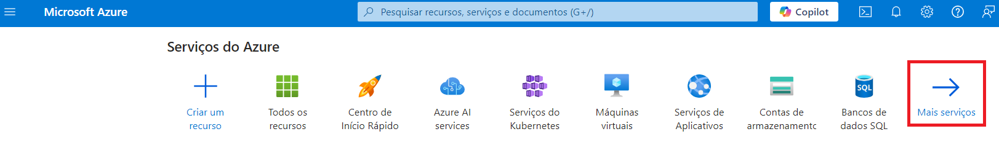
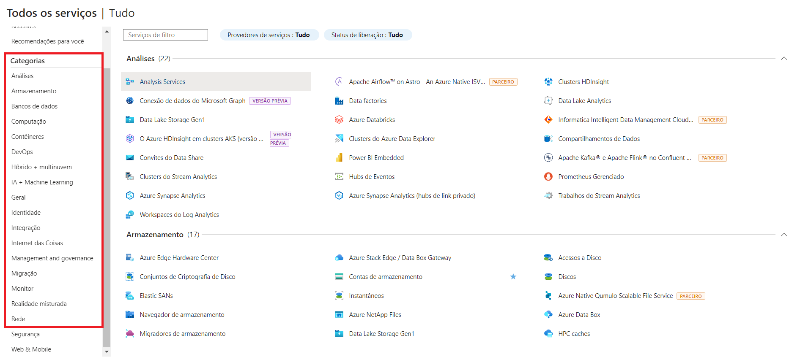

# Localização de Serviços no Microsoft Azure

Este guia contém o resumo das lições aprendidas durante o desenvolvimento do lab na DIO.

## Índice
- [Introdução](#introdução)
- [Acessando o Portal do Azure](#acessando-o-portal-do-azure)
- [Localizando Serviços por Categoria](#localizando-serviços-por-categoria)
- [Documentação Adicional](#documentação-adicional)

## Introdução

Este primeiro desafio consiste em explorar o portal do Microsoft Azure, fornecendo instruções sobre como localizar e acessar serviços disponíveis por categoria.

## Acessando o Portal do Azure

1. Abra seu navegador e acesse [portal.azure.com](https://portal.azure.com).
2. Faça login com suas credenciais da Microsoft.

## Localizando Serviços por Categoria

Na página inicial são exibidos alguns dos principais serviços disponíveis no portal do Microsoft Azure. Para visualizar todos os serviços separados por categoria, basta selecionar a opção "Mais Serviços":

Outra forma de acessar todos os serviços é utilizando o menu laterial e selecionando a opção "Todos os serviços":

Ao acessar essa opção serão exibidos todos os serviços disponíveis no portal do Microsoft Azure separados por categoria.
Através do menu lateral esquerdo, é possível selecionar a categoria desejada para encontrar um produto específico.

:warning: Serviços destacados com a tag "Versão Prévia" estão em fase de testes e podem ser descontinuados a qualquer momento pela Azure, por isso requerem maior cautela com relação ao seu uso.

## Documentação adicional

[Documentação Oficial do Microsoft Azure](https://docs.microsoft.com/azure).

[Tutorial de Serviços de Computação e Rede do Azure](https://learn.microsoft.com/pt-br/training/modules/describe-azure-compute-networking-services/).