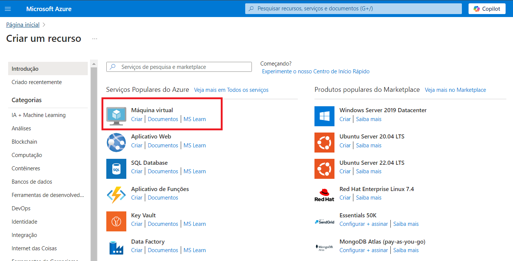

# Criando máquinas Virtuais no Microsoft Azure

Este guia contém o resumo das lições aprendidas durante o desenvolvimento do lab na DIO.

## Índice
- [Introdução](#introdução)
- [Acessando o Portal do Azure](#acessando-o-portal-do-azure)
- [Criando Máquinas Virtuais](#criando-máquinas-virtuais)
    - [Configurando a VM](#configurando-a-vm)
- [Documentação Adicional](#documentação-adicional)

## Introdução

Este desafio consiste em explorar o portal do Microsoft Azure, fornecendo instruções sobre como criar uma máquina virtual.
As máquinas virtuais do Azure (VMs) são emulações de software de computadores físicos, que incluem processador virtual, memória, armazenamento e rede.

Com as VMs, você tem controle total sobre a configuração e pode instalar qualquer coisa que precisar para realizar o trabalho. Você não precisa comprar o hardware físico quando precisar dimensionar ou estender o datacenter. Por fim, o Azure oferece serviços adicionais para monitorar, proteger e gerenciar atualizações e patches para o sistema operacional.

## Acessando o Portal do Azure

1. Abra seu navegador e acesse [portal.azure.com](https://portal.azure.com).
2. Faça login com suas credenciais da Microsoft.

## Criando Máquinas Virtuais

Na home page do Azure, em Serviços do Azure, selecione Criar um recurso. O painel Criar um recurso é exibido, exibindo produtos populares para serviços do Azure.

Ao selecionar Máquina virtual, o painel Criar máquina virtual será exibido.

### Configurando a VM

Para criar uma máquina virtual é necessário configurar os alguns parâmetros básicos:

- Subscription: Assinatura onde a VM será criada.
- Grupo de recursos: selecione o nome do grupo de recursos ou crie um novo grupo.
- Nome da máquina virtual: defina o nome da sua VM.
- Região: selecione uma localização geográfica que hospedará a VM. A região pode limitar os recursos disponíveis e há diferenças de preço entre as localizações.
- Opções de disponibilidade: deve ser definida de acordo com a necessidade de redundância de infraestrutura. O Azure oferece diversas opções de gerenciamento de disponibilidade e resiliência para os aplicativos. As VMs podem ser replicadas em Zonas de Disponibilidade ou Conjuntos de Disponibilidade. Esta opção tem impacto direto no SLA da VM criada.
- Zona de disponibilidade: devem ser selecionadas quando a opção de disponibilidade selecionada for igual a Zona de disponibilidade.
- Tipo de segurança: é possível configurar os recursos de segurança ou deixar como Standard.
- Imagem: selecione o sistema operacional desejado (por exemplo, Windows Server, Ubuntu). A escolha do sistema operacional pode influenciar o preço de computação por hora, pois o Azure inclui o custo da licença do sistema operacional no preço.
- Arquitetura de VMs: x32, x64 etc.
- Tamanho: selecione a combinação apropriada de computação, memória e armazenamento para o que deseja fazer.
- Tipo de autenticação: escolha entre senha ou chave SSH.
- Nome de Usuário: insira um nome de usuário.
- Origem de chave pública SSH: gerar um novo par de chaves.
- Porta de entrada públicas: permitir ou não portas selecionadas.
- Selecione as portas de entrada: configure as portas que serão abertas para o tráfego de entrada (ex: HTTP, SSH).

Há várias outras guias para explorar e ver as configurações que você pode alterar durante a criação da VM. Após terminar de explorar, selecione Revisar + criar para revisar e validar as configurações. Verifique se todas as configurações estão definidas de acordo com sua preferência, depois clique em Criar para implantar e criar a VM.

Você pode monitorar a implantação nos Detalhes da implantação no painel Visão geral ou no painel Notificações. Selecione o ícone de notificações na barra de ferramentas no canto superior direito para mostrar ou ocultar o painel Notificações.

O processo de implantação da VM leva alguns minutos para ser concluído. Você receberá uma notificação informando que a implantação foi bem-sucedida.

## Documentação adicional

[Documentação Oficial do Microsoft Azure](https://docs.microsoft.com/azure).

[Máquinas Virtuais no Microsoft Azure](https://learn.microsoft.com/pt-br/azure/virtual-machines/).