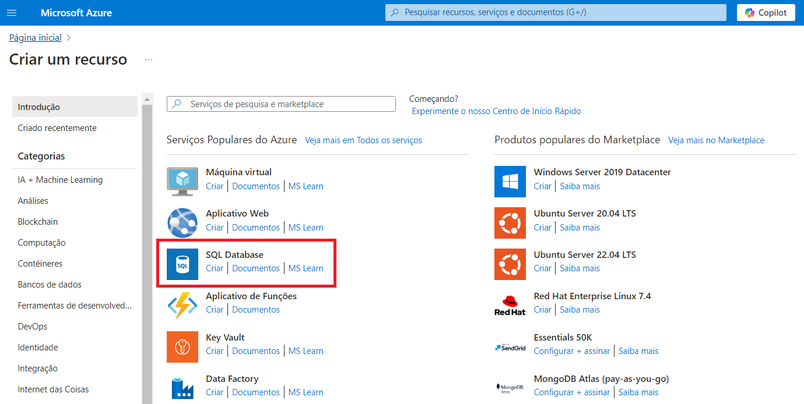

# Configurando uma instância de Banco de Dados no Microsoft Azure

Este guia contém o resumo das lições aprendidas durante o desenvolvimento do lab na DIO.

## Índice
- [Introdução](#introdução)
- [Acessando o Portal do Azure](#acessando-o-portal-do-azure)
- [Configurando uma instância de Banco de Dados](#configurando-uma-instância-de-banco-de-dados)
    - [Configurando o Banco de Dados](#configurando-o-banco-de-dados)
- [Documentação Adicional](#documentação-adicional)

## Introdução

Este desafio consiste em explorar o portal do Microsoft Azure, fornecendo instruções sobre como criar um Banco de Dados SQL.
O Banco de Dados SQL do Azure é um mecanismo de banco de dados de plataforma como serviço (PaaS) totalmente gerenciado que lida com a maioria das funções de gerenciamento de banco de dados, como atualização, aplicação de patch, backups e monitoramento sem o envolvimento do usuário.

Os recursos de PaaS integrados ao Banco de Dados SQL do Azure permitem que você se concentre nas atividades de administração e otimização de bancos de dados específicas do domínio que são críticas para sua empresa.

## Acessando o Portal do Azure

1. Abra seu navegador e acesse [portal.azure.com](https://portal.azure.com).
2. Faça login com suas credenciais da Microsoft.

## Configurando uma instância de Banco de Dados

Na home page do Azure, em Serviços do Azure, selecione Criar um recurso. O painel Criar um recurso é exibido, exibindo produtos populares para serviços do Azure.

Ao selecionar SQL Database, o painel Criar Banco de Dados SQL será exibido.

### Configurando o Banco de Dados

1. Na guia Básico do formulário Criar Banco de Dados SQL, em Detalhes do projeto, selecione a Assinatura do Azure desejada.
2. Para Grupo de recursos, selecione um grupo existente ou clique em Criar, insira o nome do novo grupo e selecione OK.
3. Para Nome do banco de dados, insira um nome.
4. Para Servidor, selecione Criar e preencha o formulário Novo servidor:
    - Nome do servidor: defina um nome exclusivo - os nomes dos servidores devem ser globalmente exclusivos para todos os servidores no Azure, não apenas para uma assinatura.
    - Localização: Selecione uma localização na lista suspensa.
    - Método de autenticação: defina o método de autenticação dentre as opções: Usar autenticação somente do Microsoft Entra | Usar autenticação do SQL e Nicrosoft Entra | Usar autenticação do SQL.
    - Logon de administrador do servidor: configure as credenciais do administrador.
5. Para o Ambiente de carga de trabalho, especifique a finalidade do banco: Desenvolvimento OU Produção.
    - A escolha do ambiente de carga de trabalho de desenvolvimento define algumas opções, entre elas:
        - A opção de Redundância do armazenamento de backup é o armazenamento com redundância local. O armazenamento com redundância local gera menos custos e é apropriado para ambientes de pré-produção que não exigem redundância do armazenamento com replicação de zona ou área geográfica.
        - Computação + armazenamento é de Uso geral, Sem servidor com um único vCore. Por padrão, há um atraso de pausa automática de uma hora.
    - Escolhendo os conjuntos de ambientes de carga de trabalho de Produção:
        - A Redundância de armazenamento de backup é o armazenamento com redundância geográfica, a opção padrão.
        - Computação + armazenamento é Uso geral, Provisionado com 2 vCores e 32 GB de armazenamento. Isso pode ser modificado na próxima etapa.
6. Em Computação + armazenamento, as configurações do item anterior podem ser modificadas.
7. Na guia Rede, para Método de conectividade, defina o acesso como público ou privado.
8. É nesta guia também que serão configuradas as regras de firewall, sendo possível permitir o acesso a partir de IPs específicos.
9. Na página Segurança, você pode optar por iniciar uma avaliação gratuita do Microsoft Defender para SQL, bem como configurar o Razão, as Identidades gerenciadas e a TDE (Transparent Data Encryption), se desejar.
10. Na página Examinar + criar, após examinar, selecione Criar para provisionar a instância de banco de dados.

## Documentação adicional

[Documentação Oficial do Microsoft Azure](https://docs.microsoft.com/azure).

[Documentação do Banco de dados SQL do Azure](https://learn.microsoft.com/pt-br/azure/azure-sql/database/?view=azuresql&WT.mc_id=APC-SQLdatabases).