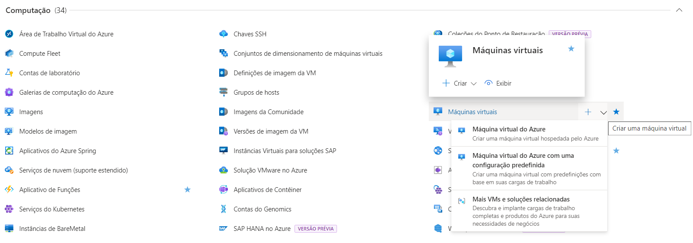

# Configurando Recursos e Dimensionamentos em Máquinas Virtuais no Microsoft Azure

Este guia contém o resumo das lições aprendidas durante o desenvolvimento do lab na DIO.

## Índice
- [Introdução](#introdução)
- [Acessando o Portal do Azure](#acessando-o-portal-do-azure)
- [Criando Máquinas Virtuais](#criando-máquinas-virtuais)
    - [Configurando o Dimensionamento](#configurando-o-dimensionamento)
    - [Vantagens do dimensionamento](#vantagens-do-dimensionamento)
- [Documentação Adicional](#documentação-adicional)

## Introdução

Este desafio consiste em explorar o portal do Microsoft Azure, fornecendo instruções sobre como configurar recursos e dimensionamentos em uma máquina virtual.

Os Conjuntos de Dimensionamento de Máquinas Virtuais permitem criar e gerenciar um grupo de VMs com balanceamento de carga. O número de instâncias de VM pode aumentar ou diminuir automaticamente em resposta à demanda ou a um agendamento definido.

Com a orquestração flexível, o Azure fornece uma experiência unificada no ecossistema de VM do Azure. Ela oferece garantias de alta disponibilidade (até 1000 VMs) ao distribuir as VMs entre domínios de falha em uma região ou zona de disponibilidade. Isso permite dimensionar seu aplicativo e manter o isolamento do domínio de falha que é essencial para executar cargas de trabalho baseadas em quorum ou com estado.

## Acessando o Portal do Azure

1. Abra seu navegador e acesse [portal.azure.com](https://portal.azure.com).
2. Faça login com suas credenciais da Microsoft.

## Criando Máquinas Virtuais

Ao selecionar Máquina virtual são disponibilizadas três opções de criação:

1. Máquina Virtual do Azure: cria uma máquina sem pré-configuração. O usuário é responsável por definir todas as configurações da VM.
2. Máquina virtual do Azure com uma configuração predefinida: cria uma máquina virtual com predefinições com base em suas cargas de trabalho, onde é informado o ambiente (desenvolvimento/teste ou produção) e o tipo de carga de trabalho (uso geral, otimizado para memória, computação otimizada).
3. Mais VMs e soluções relacionadas: cria uma máquina virtual com uma configuração predefinida que também já vem com algumas aplicações prontas para uso.

:warning: Passo a passo para configurar uma máquina virtual sem configurações predefinidas [aqui](../02-Criando%20máquinas%20Virtuais/README.md).

### Configurando o Dimensionamento

Você pode implantar um conjunto de dimensionamento com uma imagem do Windows Server ou uma imagem do Linux, como RHEL, Ubuntu ou SLES.

1. Na barra de pesquisa do portal do Azure, pesquise e selecione Conjunto de Dimensionamento de Máquinas Virtuais.
2. Selecione Criar na página Conjunto de Dimensionamento de Máquinas Virtuais.
3. Na guia Básico, em Detalhes do projeto, verifique se a assinatura correta está selecionada e selecione ou crie um grupo de recursos.
4. Em Detalhes do conjunto de dimensionamento, defina o nome do conjunto de dimensionamento e selecione uma região.
5. Em Orquestração, é possível escolher o modo entre as opções:
    - Flexível: obter alta disponibilidade em escala com tipos de máquina virtual idênticos ou múltiplos
    - Uniforme: otimizado para cargas de trabalho sem estado em grande escala com instâncias idênticas
6. Em Detalhes da instância, selecione uma imagem e uma das Distribuições com Suporte.
7. Em Contagem de instâncias é possível configurar as opções de escala que são responsáveis por aumentar ou diminuir automaticamente o número de instâncias de VM de acordo com a demanda.
    - Contagem de instâncias inicial: quantidade inicial de máquinas virtuais
    - Limite de instância: quantidade mínima e máxima de máquinas que serão escaladas
    - Escalar horizontalmente: definir o limite de CPU em % que requer o aumento de instâncias e a quantidade de instâncias que serão aumentadas quando for atingido
    - Reduzir horizontalmente: definir o limite de CPU em % que permite diminuir uma instância e a quantidade de instâncias que será reduzida quando for atingido
    - Duração da consulta: definir em minutos o tempo de duração da consulta (padrão = 10 minutos)
8. Na Conta de administrador, configure os dados de acesso do administrador.

### Vantagens do dimensionamento

- Facilidade de criar e gerenciar várias VMs
    Quando você tem muitas VMs que executam seu aplicativo, é importante manter uma configuração consistente em seu ambiente. Para um desempenho confiável do seu aplicativo, o tamanho da VM, a configuração do disco e a instalação do aplicativo devem corresponder em todas as VMs.
    Com conjuntos de dimensionamento, todas as instâncias de VM são criadas da mesma imagem e da mesma configuração do sistema operacional base. Essa abordagem permite gerenciar facilmente centenas de VMs sem outras tarefas de configuração ou gerenciamento de rede adicionais.
    Os conjuntos de dimensionamento dão suporte ao uso do Azure Load Balancer para distribuição de tráfego básico de camada 4 e ao Gateway de Aplicativo do Azure para distribuição do tráfego de camada 7 e terminação de TLS mais avançadas.
- Fornece alta disponibilidade e resiliência do aplicativo
    Os conjuntos de dimensionamento são usados para executar várias instâncias do aplicativo. Se uma dessas instâncias de VM tem um problema, os clientes continuam a acessar o aplicativo por meio de uma das outras instâncias de VM com o mínimo de interrupção.
    Para obter mais disponibilidade, você pode usar Zonas de Disponibilidade para distribuir automaticamente instâncias de VM em um conjunto de dimensionamento em um único datacenter ou em vários datacenters. A implantação de VMs em várias Zonas de Disponibilidade pode proteger você contra falhas de data center. Observe que um conjunto de dimensionamento não poderá proteger você contra falhas de data center.
- Permite que seu aplicativo dimensione automaticamente de acordo com as alterações de demanda de recursos
    A demanda do cliente pelo seu aplicativo pode mudar ao longo do dia ou da semana. De acordo com a demanda do cliente, os conjuntos de dimensionamento podem aumentar o número de instâncias de VM automaticamente, de acordo com o aumento da demanda de aplicativo, e reduzir o número de instâncias de VM de acordo com a redução de demanda.
    O dimensionamento automático também minimiza o número de instâncias de VM desnecessárias que executam seu aplicativo quando a demanda está baixa, enquanto os clientes continuam a receber um nível de desempenho aceitável conforme a demanda cresce e as instâncias de VM adicionais são adicionadas automaticamente. Esse recurso ajuda a reduzir os custos e a criar recursos do Azure de forma eficiente conforme a necessidade.
- Funciona em larga escala
    Os conjuntos de dimensionamento dão suporte a até 1.000 instâncias de VM para imagens padrão do Marketplace e imagens personalizadas por meio da Galeria de Computação do Azure (conhecida como Galeria de Imagens Compartilhadas). Se você criar um conjunto de dimensionamento usando uma imagem gerenciada, o limite será de 600 instâncias de VM.

## Documentação adicional

[Documentação Oficial do Microsoft Azure](https://docs.microsoft.com/azure).

[Documentação dos Conjuntos de Dimensionamento de Máquinas Virtuais](https://learn.microsoft.com/pt-br/azure/virtual-machine-scale-sets/?WT.mc_id=APC-Virtualmachinescalesets).