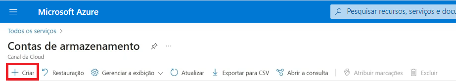
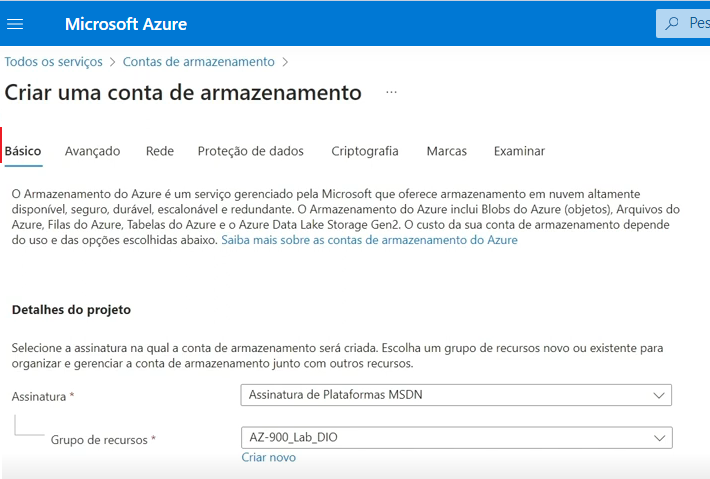
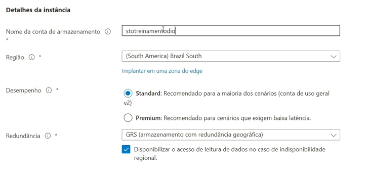
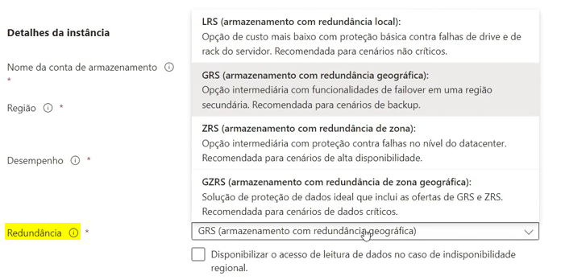

# Configurando o Armazenamento no Microsoft Azure

Este guia contém o resumo das lições aprendidas durante o desenvolvimento do lab na DIO.

## Índice
- [Introdução](#introdução)
- [Acessando o Portal do Azure](#acessando-o-portal-do-azure)
- [Criando uma Conta de Armazenamento](#criando-uma-conta-de-armazenamento)
- [Serviços de dados de armazenamento](#serviços-de-dados-de-armazenamento)
- [Benefícios do Armazenamento](#benefícios-do-armazenamento)
- [Documentação Adicional](#documentação-adicional)

## Introdução

Este desafio consiste em explorar o portal do Microsoft Azure, fornecendo instruções sobre como configurar o armazenamento no Microsoft Azure.

A plataforma do Armazenamento do Microsoft Azure é a solução de armazenamento em nuvem da Microsoft para cenários de armazenamento de dados modernos. Oferece armazenamento altamente disponível, altamente escalonável, durável e seguro para uma variedade de objetos de dados na nuvem. Os objetos de dados do Armazenamento do Microsoft Azure podem ser acessados de qualquer lugar do mundo por HTTP ou HTTPS por meio de uma API REST. 

## Acessando o Portal do Azure

1. Abra seu navegador e acesse [portal.azure.com](https://portal.azure.com).
2. Faça login com suas credenciais da Microsoft.

## Criando uma Conta de Armazenamento

Para criar uma conta de armazenamento usando o portal do Azure:

1. Em Serviços do Azure, selecione Contas de armazenamento e clique em + Criar para criar uma conta de armazenamento.

2. Em Detalhes do projeto, selecione a assinatura do Azure na qual você deseja criar a conta de armazenamento. Se você tiver apenas uma assinatura, ela deverá ser a padrão. No grupo de recursos, é possível selecionar um existente ou criar um novo.

3. Em Detalhes da instância, forneça um nome para a conta de armazenamento. Pode ser necessário adicionar alguns números aleatórios para torná-lo um nome globalmente exclusivo. Um nome da conta de armazenamento deve estar em minúsculas, só incluir números e ter entre 3 e 24 caracteres.

4. Em Região, selecione a região em que você deseja criar a conta de armazenamento.

5. Em Desempenho, selecione uma das opções disponíveis:
    - Standard permite que você tenha qualquer serviço de dados (Blob, Arquivo, Fila, Tabela) e use unidades de disco magnéticas.
    - O Premium oferece mais serviços para armazenar dados. É possível, por exemplo, armazenar dados de objeto não estruturado, como blobs de blocos ou blobs de acréscimo, e armazenamento de arquivos especializado usado para armazenar e criar compartilhamentos de arquivos premium. Essas contas de armazenamento usam SSDs (unidades de estado sólido) para armazenamento.
    :warning: Ao optar pelo Premium, a cobrança será pela alocação total independente de estar em uso.

6. Em Redundância, é definida a estratégia usada para fazer cópias dos dados para se proteger contra falhas de hardware ou desastres naturais. O LRS atende em ambientes de teste e homologação, porém não é indicado para ambientes produtivos.

7. Para revisar as configurações, selecione Revisar + criar. O Azure executará uma validação final.

8. Após a conclusão da validação, escolha Criar. Você deverá ver uma notificação de que a implantação está em andamento.

9. Quando você vir uma notificação de que a implantação está concluída, selecione Ir para o recurso.

## Serviços de dados de armazenamento

A plataforma de Armazenamento do Microsoft Azure inclui os seguintes serviços de dados:
1. Blobs do Azure: um repositório de objetos altamente escalonável para texto e dados binários. Ela também inclui suporte para análise de Big Data por meio do Data Lake Storage Gen2.
2. Arquivos do Azure: compartilhamentos de arquivos gerenciados para implantações locais e em nuvem.
3. Azure Elastic SAN: uma solução totalmente integrada que simplifica a implantação, a escala, o gerenciamento e a configuração de uma SAN no Azure.
4. Filas do Azure: um armazenamento de mensagens para um sistema de mensagens confiável entre componentes do aplicativo.
5. Tabelas do Azure: Um armazenamento NoSQL para um armazenamento sem esquemas de dados estruturados.
6. Azure Managed Disks: volumes de armazenamento no nível do bloco para VMs do Azure.
7. Armazenamento de Contêineres do Azure: um serviço de gerenciamento de volume, implantação e orquestração criado nativamente para contêineres.

Cada serviço é acessado por meio de uma conta de armazenamento com um endereço exclusivo.

## Benefícios do Armazenamento

- Durável e altamente disponível: A redundância garante a segurança dos seus dados no caso de falhas de hardware transitórias. Você também pode optar por replicar os dados em data centers ou regiões geográficas para obter mais proteção contra catástrofes locais ou desastres naturais. Os dados replicados dessa maneira permanecem altamente disponíveis no caso de uma interrupção inesperada.
- Seguro: Todos os dados gravados em uma conta de armazenamento do Azure são criptografados pelo serviço. O Armazenamento do Azure oferece um controle refinado sobre quem possui acesso aos seus dados.
- Escalonável: O Armazenamento do Azure foi concebido para ser altamente escalonável e atender às necessidades de desempenho e armazenamento de dados dos aplicativos atuais.
- Gerenciado: o Azure cuida da manutenção de hardware, das atualizações e dos problemas críticos para você.
- Acessível: Os dados no Armazenamento do Azure são acessíveis de qualquer lugar no mundo por HTTP ou HTTPS. A Microsoft fornece bibliotecas de clientes para o Armazenamento do Microsoft Azure em várias linguagens, incluindo .NET, Java, Node.js, Python, Go, entre outras, bem como uma API REST bem desenvolvida. O Armazenamento do Azure oferece suporte para scripts no Azure PowerShell ou na CLI do Azure. E o Portal do Azure e o Gerenciador de Armazenamento do Azure oferecem soluções visualmente fáceis para o trabalho com os seus dados.

## Documentação adicional

[Documentação Oficial do Microsoft Azure](https://docs.microsoft.com/azure).

[Documentação do Armazenamento do Azure](https://learn.microsoft.com/pt-br/azure/storage/?WT.mc_id=APC-Storageaccounts).