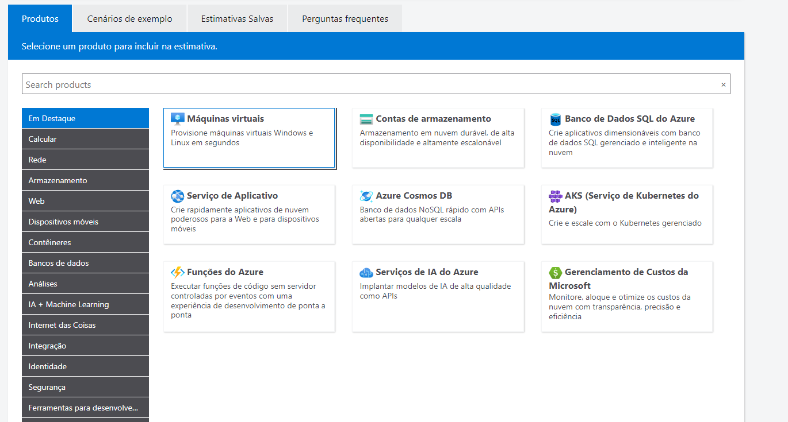
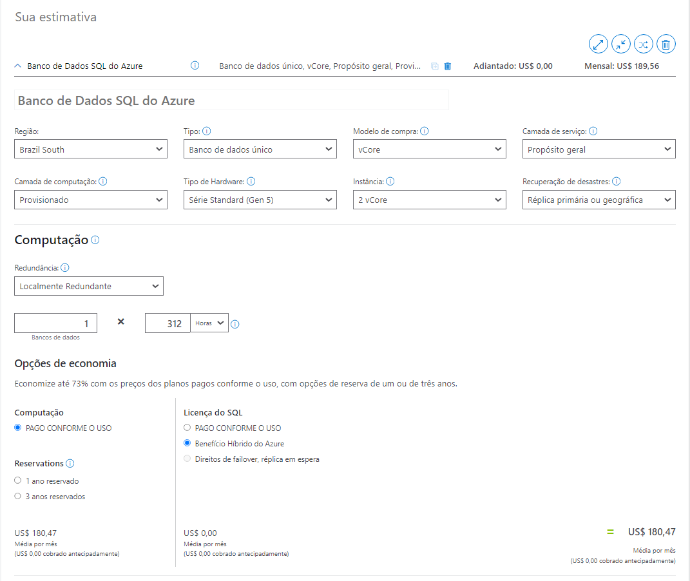
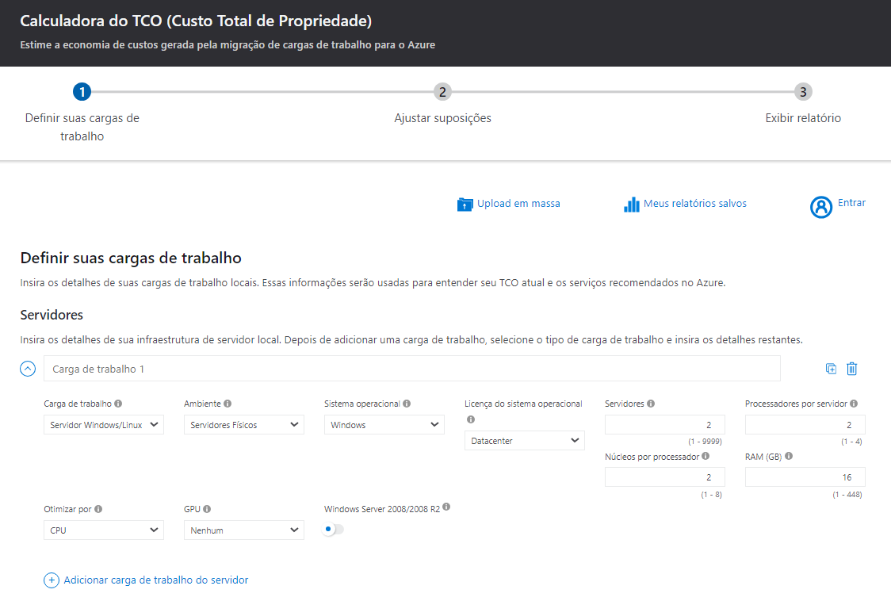
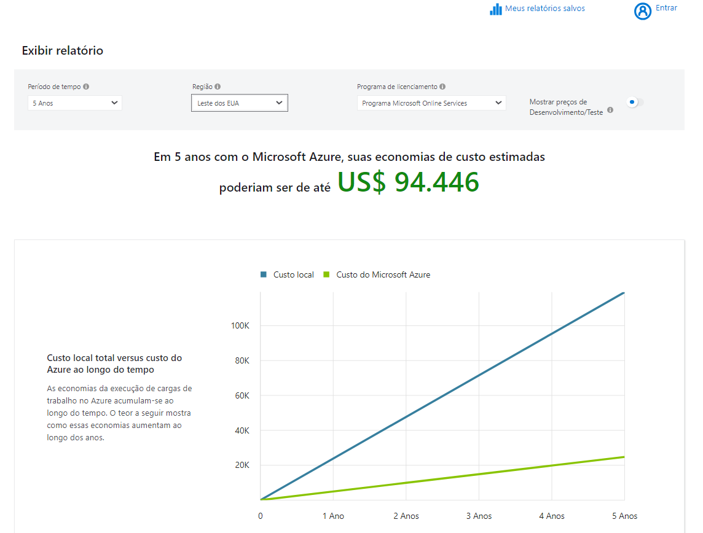
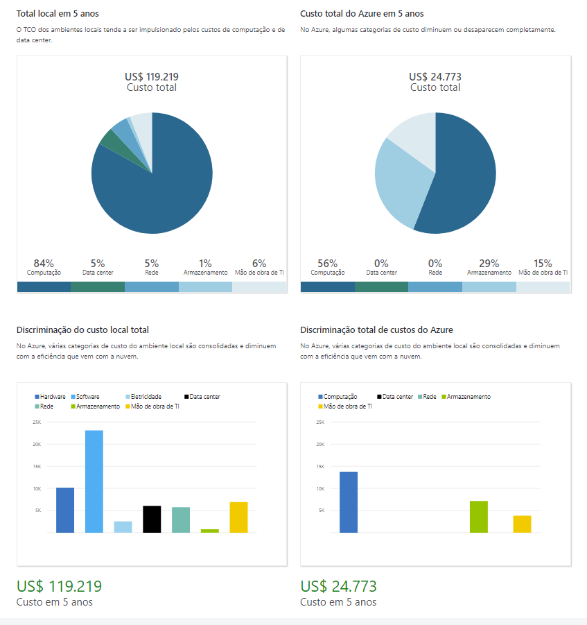

# Gerenciamento de Custos no Microsoft Azure

Este guia contém o resumo das lições aprendidas durante o desenvolvimento do lab na DIO.

## Índice
- [Introdução](#introdução)
- [Gerenciamento de Custos](#gerenciamento-de-custos)
- [Calculadoras Preço e Custo Total de Propriedade](#calculadoras-preço-e-custo-total-de-propriedade)
    - [Calculadora de Preço](#calculadora-de-preço)
    - [Calculadora de TCO](#calculadora-de-tco)
- [Documentação Adicional](#documentação-adicional)

## Introdução

Este desafio consiste em explorar o portal do Microsoft Azure, analisando as opções disponíveis para gerenciamento de custos.

O Gerenciamento de Custos da Microsoft é um conjunto de ferramentas que ajuda as organizações a analisar, monitorar e otimizar os seus gastos com o Microsoft Cloud. Ele está disponível para qualquer pessoa com acesso a uma conta de cobrança, assinatura, grupo de recursos ou grupo de gerenciamento.

Você pode acessar o Gerenciamento de Custos nas experiências de cobrança e gerenciamento de recursos ou separadamente como uma ferramenta autônoma otimizada para equipes do FinOps que gerenciam o custo em vários escopos. Você também pode automatizar e estender as capacidades nativas ou enriquecer suas próprias ferramentas e processos com custo para maximizar a visibilidade organizacional e a responsabilidade com todos os stakeholders e atingir suas metas de otimização e eficiência mais rapidamente.

## Gerenciamento de Custos

O Gerenciamento de Custos permite verificar rapidamente os custos de recursos do Azure, criar alertas com base nos gastos com recursos e criar orçamentos que podem ser usados para automatizar o gerenciamento de recursos.

A análise de custo é um subconjunto de Gerenciamento de Custos que apresenta um visual rápido para os custos do Azure. Usando a análise de custo, você pode visualizar rapidamente o custo total de várias maneiras, inclusive por ciclo de cobrança, região, recurso etc.

Os alertas de custo fornecem um só local para verificar rapidamente todos os diferentes tipos de alerta que podem aparecer no serviço de Gerenciamento de Custos. Os três tipos de alertas que podem aparecer são:
- Alertas de orçamento: notificam quando os gastos, com base em uso ou custos, atingem ou excedem o valor definido na condição de alerta do orçamento.
- Alertas de crédito: notificam quando seus compromissos monetários de crédito do Azure são consumidos.
- Alertas de cota de gastos do departamento: notificam quando os gastos do departamento atingem um limite fixo da cota.

## Calculadoras Preço e Custo Total de Propriedade

A calculadora de preços e a calculadora TCO (custo total de propriedade) ajudam a entender possíveis despesas do Azure. Ambas podem ser acessadas pela Internet e permitem criar uma configuração.

### Calculadora de preço

A calculadora de preços foi projetada para fornecer um custo estimado para provisionar recursos no Azure. Você pode obter uma estimativa para recursos individuais, criar uma solução ou usar um cenário de exemplo para ver uma estimativa dos gastos do Azure. O foco da calculadora de preços está no custo dos recursos provisionados no Azure.

Com a calculadora de preços, você pode estimar o custo de todos os recursos provisionados, incluindo computação, armazenamento e custos de rede associados. Você pode até mesmo considerar diferentes opções de armazenamento, como tipo de armazenamento, camada de acesso e redundância.

### Calculadora de TCO

A calculadora de TCO foi projetada para comparar os custos para executar uma infraestrutura local versus uma infraestrutura de nuvem do Azure. Com a calculadora de TCO, você insere sua configuração de infraestrutura atual, incluindo servidores, bancos de dados, armazenamento e tráfego de rede de saída. Então a calculadora de TCO compara os custos previstos para seu ambiente atual com um ambiente do Azure que dá suporte aos mesmos requisitos de infraestrutura.

## Documentação adicional

[Documentação Oficial do Microsoft Azure](https://docs.microsoft.com/azure).

[Documentação de Gerenciamento de Custos e Cobrança](https://learn.microsoft.com/pt-br/azure/cost-management-billing/).

[Calculadora de preço](https://azure.microsoft.com/pt-br/pricing/calculator/).

[Calculadora do TCO (Custo Total de Propriedade)](https://azure.microsoft.com/pt-br/pricing/tco/calculator/).