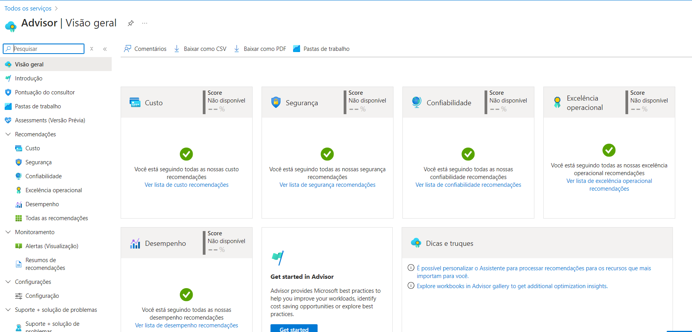
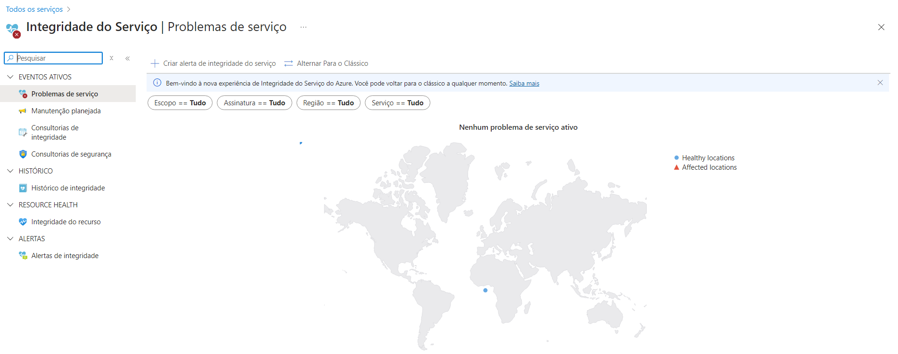
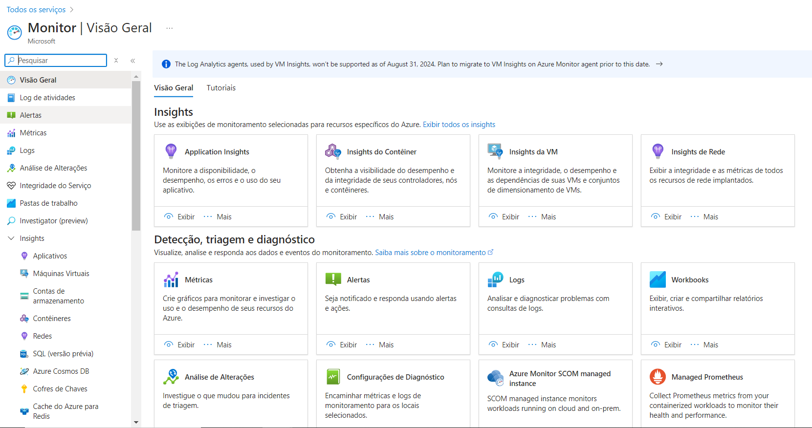

# Ferramentas de Monitoramento no Microsoft Azure

Este guia contém o resumo das lições aprendidas durante o desenvolvimento do lab na DIO.

## Índice
- [Introdução](#introdução)
- [Azure Advisor](#azure-advisor)
- [Integridade do Serviço](#integridade-do-serviço)
- [Azure Monitor](#azure-monitor)
- [Documentação Adicional](#documentação-adicional)

## Introdução

Este desafio consiste em explorar o portal do Microsoft Azure, analisando as ferramentas de monitoramento no Microsoft Azure.

## Azure Advisor

O Assistente é um assistente de nuvem digital que ajuda você a seguir as melhores práticas para otimizar suas implantações do Azure. Ele analisa a configuração de seus recursos e a telemetria de uso e, em seguida, recomenda soluções que podem lhe ajudar a melhorar a relação custo-benefício, o desempenho, a confiabilidade e a segurança de seus recursos do Azure.

O painel do Assistente exibe recomendações personalizadas para todas as assinaturas. As recomendações são divididas em cinco categorias:
- Confiabilidade: para garantir e melhorar a continuidade de seus aplicativos comercialmente críticos.
- Segurança: para detectar ameaças e vulnerabilidades que podem levar a possíveis violações de segurança.
- Desempenho: para melhorar a velocidade dos aplicativos.
- Custo: para otimizar e reduzir o gasto geral do Azure.
- Excelência operacional: para ajudar você a obter eficiência de processos e fluxos de trabalho, capacidade de gerenciamento de recursos e melhores práticas de implantação.

## Integridade do Serviço

A Integridade do Serviço do Azure é uma combinação de três serviços menores separados.

1. Status do Azure: informa sobre interrupções de serviço no Azure na página Status do Azure. A página é uma exibição global da integridade de todos os serviços do Azure em todas as regiões. A página de status é uma boa referência para incidentes com impacto generalizado, mas é altamente recomendável que os usuários atuais do Azure aproveitem a integridade do serviço para se manterem informados sobre incidentes e manutenção do Azure.

2. Integridade do serviço: fornece uma exibição personalizada da integridade dos serviços e das regiões do Azure que você está usando. Esse é o melhor lugar onde procurar serviços que afetam as comunicações sobre interrupções, atividades de manutenção planejada e outros avisos de integridade, porque a experiência autenticada da Integridade do Serviço sabe quais serviços e recursos você usa atualmente. A melhor maneira de usar a Integridade do Serviço é configurar alertas de Integridade do Serviço para notificá-lo por meio de seus canais de comunicação preferenciais quando problemas de serviço, manutenção planejada ou outras alterações podem afetar os serviços do Azure e as regiões que você usa.

3. Resource Health: fornece informações sobre a integridade de seus recursos de nuvem individuais, como uma instância de máquina virtual específica. Usando o Azure Monitor, você também pode configurar alertas para notificá-lo de alterações de disponibilidade para seus recursos de nuvem. O Resource Health, em conjunto com as notificações do Azure Monitor, ajuda você a ficar mais bem informado sobre a disponibilidade de seus recursos de minuto a minuto e a avaliar rapidamente se um problema ocorreu devido a uma complicação no seu lado ou está relacionado a um evento da plataforma do Azure.

Juntas, essas experiências fornecem uma visão abrangente da integridade do Azure, na granularidade mais relevante para você.

## Azure Monitor

O Azure Monitor é uma solução de monitoramento abrangente para coletar, analisar e responder à dados de monitoramento dos ambientes de nuvem e locais. Você pode usar o Azure Monitor para maximizar a disponibilidade e o desempenho de seus aplicativos e serviços. Ele ajuda você a entender como seus aplicativos estão sendo executados e permite que você responda manual e programaticamente a eventos do sistema.

O Azure Monitor coleta e agrega os dados de cada camada e cada componente do seu sistema em vários locatários e assinaturas do Azure e fora do Azure. Ele o armazena em uma plataforma de dados comum para consumo por um conjunto comum de ferramentas que podem correlacionar, analisar, visualizar e/ou responder aos dados. Você também pode integrar outras ferramentas que são Microsoft e que não são da Microsoft.

## Documentação adicional

[Documentação Oficial do Microsoft Azure](https://docs.microsoft.com/azure).

[Azure Advisor](https://learn.microsoft.com/pt-br/azure/advisor/).

[Integridade do Serviço](https://learn.microsoft.com/pt-br/azure/service-health/).

[Azure Monitor](https://learn.microsoft.com/pt-br/azure/azure-monitor/).